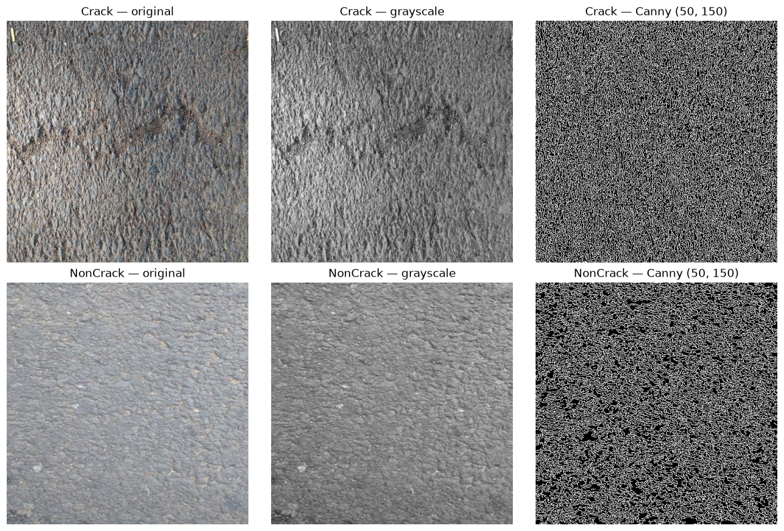

# DS605 Lab 6 — Image & Text Feature Extraction and Classification

Two separate classification tasks:
- **Part A**: asphalt crack detection from raw images
- **Part B**: email spam detection from word-count vectors

Both use traditional ML models (no CNNs, no deep learning).

## Datasets

- **Images**: 400 asphalt images — 200 Cracks, 200 NonCracks (`data/images/`). All 448×448 RGB.
- **Text**: 5172 emails already vectorized as 3000 word-count columns plus a `Prediction` label (`data/emails.csv`). Ham 3672 / Spam 1500.

## Part A — Image features + classification

Pipeline:
1. Read each image with OpenCV, convert to grayscale
2. Extract per-image features:
   - mean brightness, contrast (std), median brightness, 25th/75th percentiles
   - dark-pixel ratio (<50), bright-pixel ratio (>200)
   - Canny edge density (low=50, high=150)
3. Save to `data/image_features.csv` (400 rows × 10 cols)
4. Train three classifiers on an 80/20 stratified split (seed 42):
   LogisticRegression, RandomForest, SVM-RBF

### Image results

| Model | Train (s) | Pred (s) | Accuracy | Precision | Recall | F1 |
|---|---|---|---|---|---|---|
| LogReg | 0.0085 | 0.0003 | 0.9000 | 0.8810 | 0.9250 | 0.9024 |
| **RandomForest** | 0.1603 | 0.0092 | **0.9500** | 0.9286 | 0.9750 | **0.9512** |
| SVM-RBF | 0.0022 | 0.0009 | 0.9125 | 0.8837 | 0.9500 | 0.9157 |

RandomForest wins at 95% accuracy, F1 0.9512.

## Part B — Text representation + classification

The Kaggle dataset ships pre-vectorized: 3000 word-count columns per email.

Two representations compared:
- **Raw counts** (as shipped)
- **TF-IDF weights** applied on top via `TfidfTransformer`

Two models: LogisticRegression, MultinomialNB.

### Text results

| Model | Representation | Features | Train (s) | Pred (s) | Accuracy | Precision | Recall | F1 |
|---|---|---|---|---|---|---|---|---|
| **LogReg** | **counts** | 3000 | 4.3796 | 0.0045 | **0.9826** | **0.9578** | **0.9833** | **0.9704** |
| MNB | counts | 3000 | 0.3203 | 0.0206 | 0.9420 | 0.8681 | 0.9433 | 0.9042 |
| LogReg | tfidf | 3000 | 0.1212 | 0.0009 | 0.9507 | 0.9308 | 0.8967 | 0.9134 |
| MNB | tfidf | 3000 | 0.0101 | 0.0022 | 0.8802 | 0.9444 | 0.6233 | 0.7510 |

Key observations:
- **Raw counts beat TF-IDF** on this task for both models. Spam words like *viagra*, *cialis*, *pills* are inherently rare across the corpus, so TF-IDF weights them high but also inflates many rare legitimate words — diluting the crisp spam signal.
- **LogReg on counts** has the best accuracy (98.26%) but takes 4.38s to train.
- **LogReg on TF-IDF** trains 36× faster (0.12s) with only 3 points of accuracy lost. That's a strong speed/accuracy trade-off.
- **MNB on TF-IDF collapses to F1 0.75** because Naive Bayes expects counts, not fractional weights. TF-IDF breaks its assumption.

## Part C — Representation improvement

### Image side
Tried: adding Sobel gradient magnitude and Laplacian variance, tuning Canny thresholds (four pairs tested), reducing feature set to 5 discriminative features, tuning RandomForest (300 trees + class_weight='balanced').

Result:

| Model | Part A Acc | Part C Acc | Δ |
|---|---|---|---|
| LogReg | 0.9000 | 0.8625 | −0.0375 |
| RandomForest | 0.9500 | 0.9500 | 0 |
| SVM-RBF | 0.9125 | **0.9250** | **+0.0125** |

Canny threshold tuning showed low=150/high=250 maximizes the crack-vs-noncrack gap (0.067 vs 0.012 at baseline), but neither this nor the extra texture features moved RandomForest off 95%. **Hand-crafted intensity features saturate at ~95% on this dataset.** Beating that would require learned representations (CNNs), which the assignment prohibits.

The improved feature set did help SVM (+1.25 pts) — the reduced 5-feature representation gave it a cleaner decision boundary.

### Trade-offs documented

- **Feature dimensionality**: 8 → 7 → 5. Less is not worse here — RandomForest found the same signal in 5 features as in 8.
- **Computation**: RF training went from 0.16s (100 trees) to 0.48s (300 trees) with no accuracy gain — 3× cost for zero benefit.
- **Best cost/performance**: LogReg on TF-IDF for text (0.12s, F1 0.9134) vs LogReg on counts (4.38s, F1 0.9704). Worth 36× the compute for +5.7 F1 points? Depends on the use case.

## Files

- `part_a_images.py` — image feature extraction + classifiers
- `part_b_text.py` — count vs TF-IDF + classifiers
- `part_c_improve.py` — feature experiments, Canny tuning, RF tuning
- `part_c_compare.py` — comparison tables
- `data/images/Cracks/`, `data/images/NonCracks/` — 400 asphalt images
- `data/emails.csv` — email dataset
- `data/image_features.csv` — extracted image features
- `data/image_features_improved.csv` — improved features
- `data/part_a_results.json`, `data/part_b_results.json`, `data/part_c_results.json`
- `data/comparison.md` — markdown comparison tables

## How to run

```bash
pip install -r requirements.txt
python part_a_images.py
python part_b_text.py
python part_c_improve.py
python part_c_compare.py

## Sample visualization

